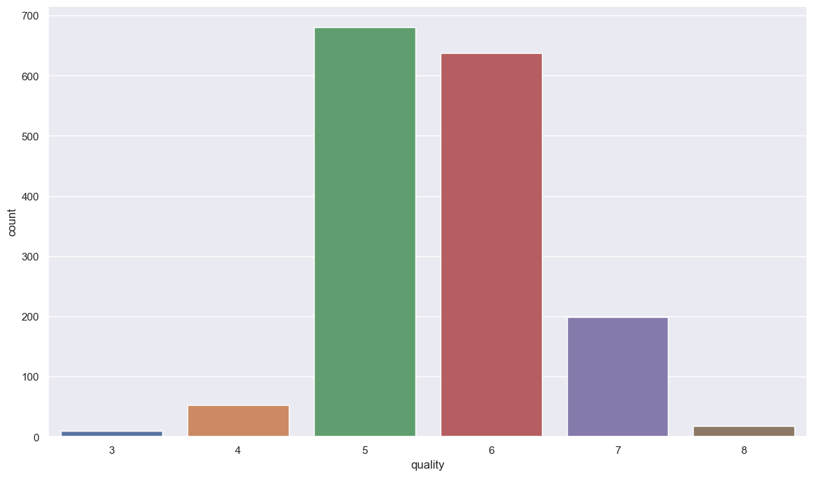
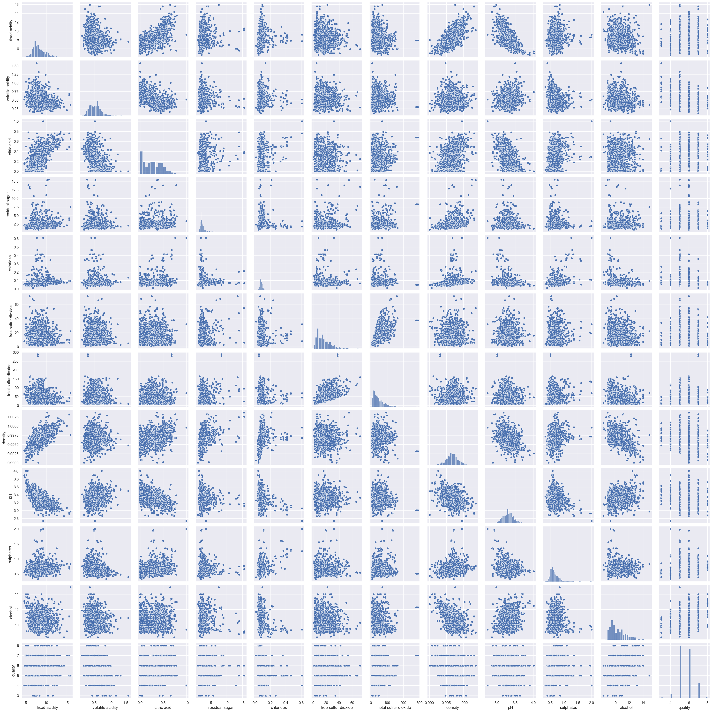
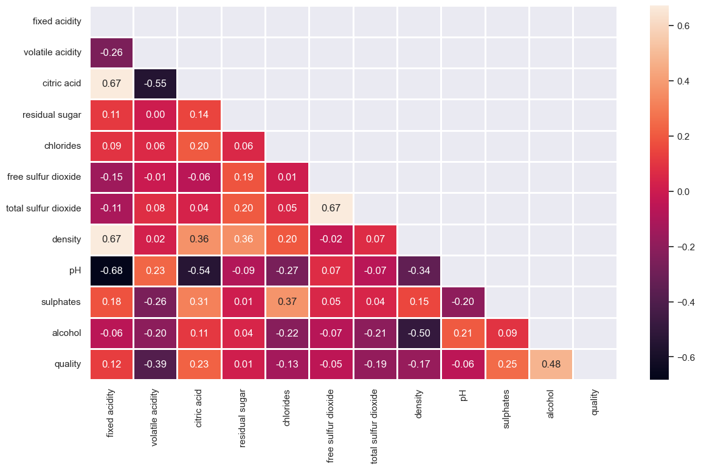
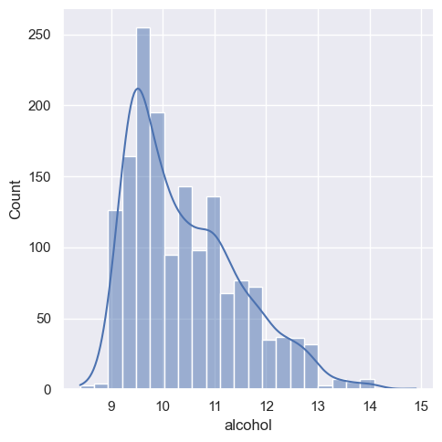
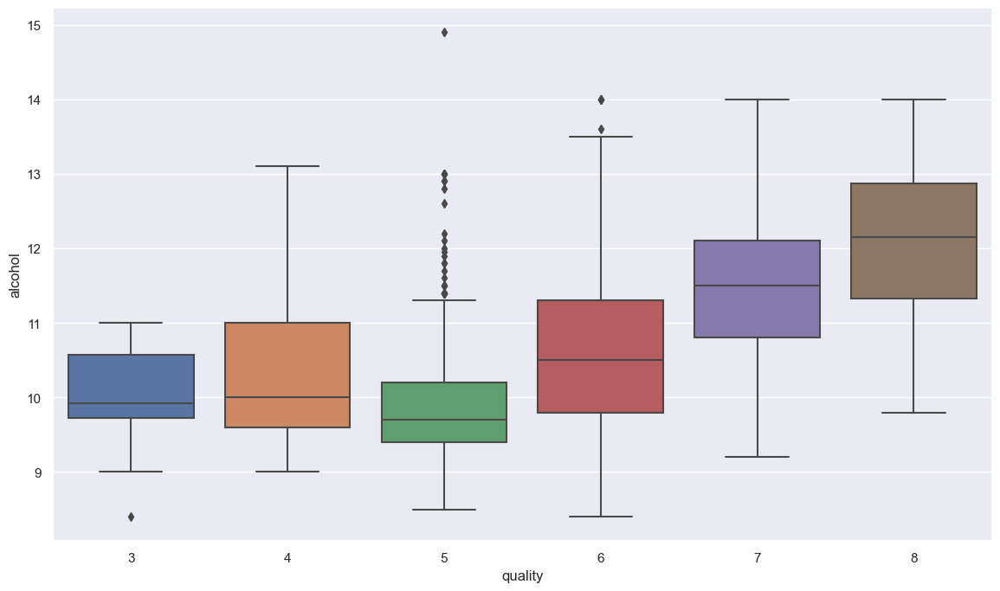
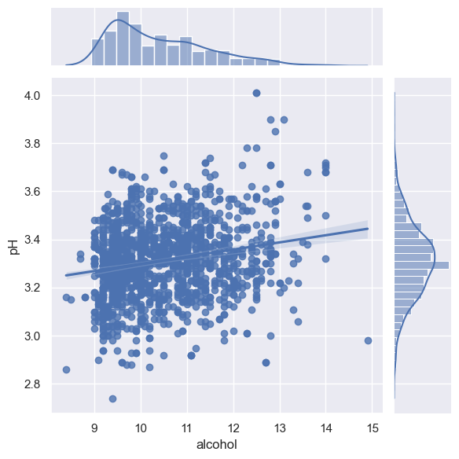
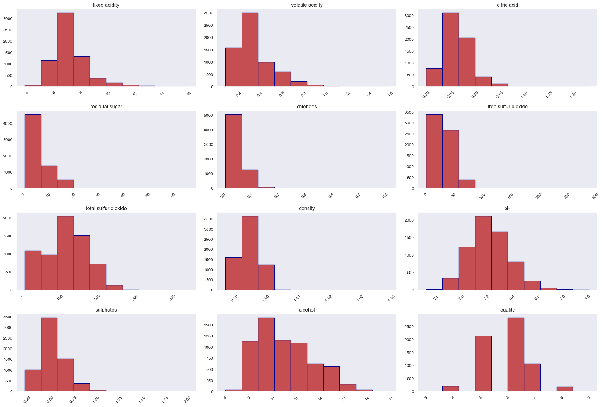
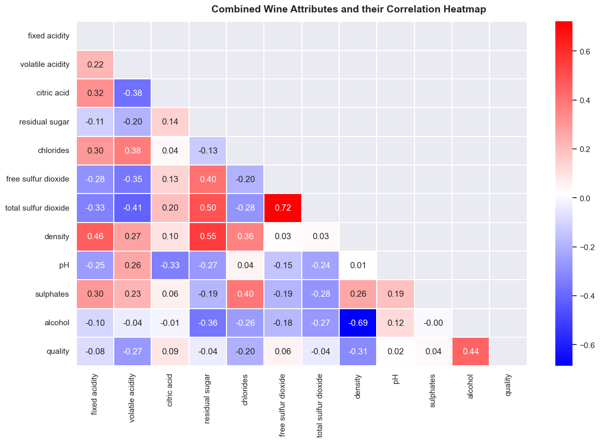
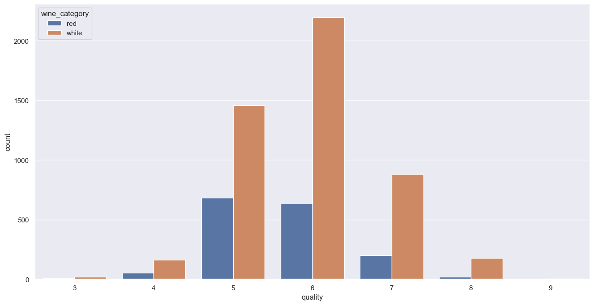
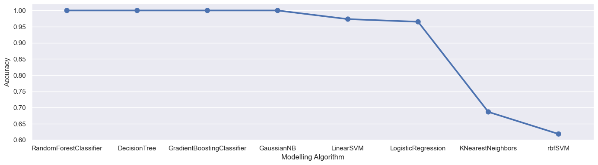

```python
import pandas  as pd
import numpy as np
import seaborn as sns
from scipy.stats import skew
from scipy.stats import pearsonr
sns.set(rc={'figure.figsize': (14, 8)})
import warnings
warnings.filterwarnings('ignore')
```


```python
redwine = pd.read_csv('winequality-red.csv',delimiter=';')
whitewine = pd.read_csv('winequality-white.csv',delimiter=';')
```


```python
redwine.head()
```


<div>
<style scoped>
    .dataframe tbody tr th:only-of-type {
        vertical-align: middle;
    }

    .dataframe tbody tr th {
        vertical-align: top;
    }

    .dataframe thead th {
        text-align: right;
    }
</style>
<table border="1" class="dataframe">
  <thead>
    <tr style="text-align: right;">
      <th></th>
      <th>fixed acidity</th>
      <th>volatile acidity</th>
      <th>citric acid</th>
      <th>residual sugar</th>
      <th>chlorides</th>
      <th>free sulfur dioxide</th>
      <th>total sulfur dioxide</th>
      <th>density</th>
      <th>pH</th>
      <th>sulphates</th>
      <th>alcohol</th>
      <th>quality</th>
    </tr>
  </thead>
  <tbody>
    <tr>
      <th>0</th>
      <td>7.4</td>
      <td>0.70</td>
      <td>0.00</td>
      <td>1.9</td>
      <td>0.076</td>
      <td>11.0</td>
      <td>34.0</td>
      <td>0.9978</td>
      <td>3.51</td>
      <td>0.56</td>
      <td>9.4</td>
      <td>5</td>
    </tr>
    <tr>
      <th>1</th>
      <td>7.8</td>
      <td>0.88</td>
      <td>0.00</td>
      <td>2.6</td>
      <td>0.098</td>
      <td>25.0</td>
      <td>67.0</td>
      <td>0.9968</td>
      <td>3.20</td>
      <td>0.68</td>
      <td>9.8</td>
      <td>5</td>
    </tr>
    <tr>
      <th>2</th>
      <td>7.8</td>
      <td>0.76</td>
      <td>0.04</td>
      <td>2.3</td>
      <td>0.092</td>
      <td>15.0</td>
      <td>54.0</td>
      <td>0.9970</td>
      <td>3.26</td>
      <td>0.65</td>
      <td>9.8</td>
      <td>5</td>
    </tr>
    <tr>
      <th>3</th>
      <td>11.2</td>
      <td>0.28</td>
      <td>0.56</td>
      <td>1.9</td>
      <td>0.075</td>
      <td>17.0</td>
      <td>60.0</td>
      <td>0.9980</td>
      <td>3.16</td>
      <td>0.58</td>
      <td>9.8</td>
      <td>6</td>
    </tr>
    <tr>
      <th>4</th>
      <td>7.4</td>
      <td>0.70</td>
      <td>0.00</td>
      <td>1.9</td>
      <td>0.076</td>
      <td>11.0</td>
      <td>34.0</td>
      <td>0.9978</td>
      <td>3.51</td>
      <td>0.56</td>
      <td>9.4</td>
      <td>5</td>
    </tr>
  </tbody>
</table>
</div>


```python
redwine.info()
```

    <class 'pandas.core.frame.DataFrame'>
    RangeIndex: 1599 entries, 0 to 1598
    Data columns (total 12 columns):
     #   Column                Non-Null Count  Dtype  
    ---  ------                --------------  -----  
     0   fixed acidity         1599 non-null   float64
     1   volatile acidity      1599 non-null   float64
     2   citric acid           1599 non-null   float64
     3   residual sugar        1599 non-null   float64
     4   chlorides             1599 non-null   float64
     5   free sulfur dioxide   1599 non-null   float64
     6   total sulfur dioxide  1599 non-null   float64
     7   density               1599 non-null   float64
     8   pH                    1599 non-null   float64
     9   sulphates             1599 non-null   float64
     10  alcohol               1599 non-null   float64
     11  quality               1599 non-null   int64  
    dtypes: float64(11), int64(1)
    memory usage: 150.0 KB
    


```python
whitewine.info()
```

    <class 'pandas.core.frame.DataFrame'>
    RangeIndex: 4898 entries, 0 to 4897
    Data columns (total 12 columns):
     #   Column                Non-Null Count  Dtype  
    ---  ------                --------------  -----  
     0   fixed acidity         4898 non-null   float64
     1   volatile acidity      4898 non-null   float64
     2   citric acid           4898 non-null   float64
     3   residual sugar        4898 non-null   float64
     4   chlorides             4898 non-null   float64
     5   free sulfur dioxide   4898 non-null   float64
     6   total sulfur dioxide  4898 non-null   float64
     7   density               4898 non-null   float64
     8   pH                    4898 non-null   float64
     9   sulphates             4898 non-null   float64
     10  alcohol               4898 non-null   float64
     11  quality               4898 non-null   int64  
    dtypes: float64(11), int64(1)
    memory usage: 459.3 KB
    


```python
whitewine.head()
```


<div>
<style scoped>
    .dataframe tbody tr th:only-of-type {
        vertical-align: middle;
    }

    .dataframe tbody tr th {
        vertical-align: top;
    }

    .dataframe thead th {
        text-align: right;
    }
</style>
<table border="1" class="dataframe">
  <thead>
    <tr style="text-align: right;">
      <th></th>
      <th>fixed acidity</th>
      <th>volatile acidity</th>
      <th>citric acid</th>
      <th>residual sugar</th>
      <th>chlorides</th>
      <th>free sulfur dioxide</th>
      <th>total sulfur dioxide</th>
      <th>density</th>
      <th>pH</th>
      <th>sulphates</th>
      <th>alcohol</th>
      <th>quality</th>
    </tr>
  </thead>
  <tbody>
    <tr>
      <th>0</th>
      <td>7.0</td>
      <td>0.27</td>
      <td>0.36</td>
      <td>20.7</td>
      <td>0.045</td>
      <td>45.0</td>
      <td>170.0</td>
      <td>1.0010</td>
      <td>3.00</td>
      <td>0.45</td>
      <td>8.8</td>
      <td>6</td>
    </tr>
    <tr>
      <th>1</th>
      <td>6.3</td>
      <td>0.30</td>
      <td>0.34</td>
      <td>1.6</td>
      <td>0.049</td>
      <td>14.0</td>
      <td>132.0</td>
      <td>0.9940</td>
      <td>3.30</td>
      <td>0.49</td>
      <td>9.5</td>
      <td>6</td>
    </tr>
    <tr>
      <th>2</th>
      <td>8.1</td>
      <td>0.28</td>
      <td>0.40</td>
      <td>6.9</td>
      <td>0.050</td>
      <td>30.0</td>
      <td>97.0</td>
      <td>0.9951</td>
      <td>3.26</td>
      <td>0.44</td>
      <td>10.1</td>
      <td>6</td>
    </tr>
    <tr>
      <th>3</th>
      <td>7.2</td>
      <td>0.23</td>
      <td>0.32</td>
      <td>8.5</td>
      <td>0.058</td>
      <td>47.0</td>
      <td>186.0</td>
      <td>0.9956</td>
      <td>3.19</td>
      <td>0.40</td>
      <td>9.9</td>
      <td>6</td>
    </tr>
    <tr>
      <th>4</th>
      <td>7.2</td>
      <td>0.23</td>
      <td>0.32</td>
      <td>8.5</td>
      <td>0.058</td>
      <td>47.0</td>
      <td>186.0</td>
      <td>0.9956</td>
      <td>3.19</td>
      <td>0.40</td>
      <td>9.9</td>
      <td>6</td>
    </tr>
  </tbody>
</table>
</div>


```python
redwine.isnull().sum()
```


    fixed acidity           0
    volatile acidity        0
    citric acid             0
    residual sugar          0
    chlorides               0
    free sulfur dioxide     0
    total sulfur dioxide    0
    density                 0
    pH                      0
    sulphates               0
    alcohol                 0
    quality                 0
    dtype: int64


```python
whitewine.isnull().sum()
```


    fixed acidity           0
    volatile acidity        0
    citric acid             0
    residual sugar          0
    chlorides               0
    free sulfur dioxide     0
    total sulfur dioxide    0
    density                 0
    pH                      0
    sulphates               0
    alcohol                 0
    quality                 0
    dtype: int64


```python
sns.countplot(x = 'quality',data= redwine)
```


    <AxesSubplot:xlabel='quality', ylabel='count'>


    

    


majority of the red wine belongs to the group with quality labels 5 and 6


```python
sns.pairplot(redwine)
```


    <seaborn.axisgrid.PairGrid at 0x1fdc64d98e0>


    

    


- Positive correlation between fixed acidity and density
- Negative correlation of acidity with pH
- Negative correlation between alcohol percentage and density


```python
corr= redwine.corr()
# Getting the Upper Triangle of the co-relation matrix
matrix = np.triu(corr)
```


```python
sns.heatmap(corr,annot = True, fmt='.2f',linewidths=2,mask=matrix)
```


    <AxesSubplot:>


    

    


The quality column has a positive correlation with alcohol, sulfates, residual sugar, citric acid, and fixed acidity.
- Alcohol is positively correlated with the quality of the red wine.
- Alcohol has a weak positive correlation with the pH value.
- Citric acid and density have a strong positive correlation with fixed acidity.
- pH has a negative correlation with density, fixed acidity, citric acid, and sulfates.


```python
sns.displot(x=redwine.alcohol,kde = True)
```


    <seaborn.axisgrid.FacetGrid at 0x1fdc64e6d60>


    

    


Alcohol distribution is positively skewed with the quality  of the red wine.


```python
skew(redwine.alcohol)
```


    0.8600210646566755


The output verifies that alcohol is positively skewed. That gives deeper insight into the alcohol column.


```python
redwine.columns
```


    Index(['fixed acidity', 'volatile acidity', 'citric acid', 'residual sugar',
           'chlorides', 'free sulfur dioxide', 'total sulfur dioxide', 'density',
           'pH', 'sulphates', 'alcohol', 'quality'],
          dtype='object')


```python
sns.boxplot(x='quality',y = 'alcohol',data = redwine)
```


    <AxesSubplot:xlabel='quality', ylabel='alcohol'>


    

    


Boxplot helps to display the outlier here quality 5 has more outlier than others


```python
sns.jointplot(x = 'alcohol',y = 'pH',data = redwine,kind = 'reg')
```


    <seaborn.axisgrid.JointGrid at 0x1fdc5d22850>


    

    


Alcohol is weakly positively related to the pH values


```python
def get_correlation(column1, column2, df):
    pearson_corr, p_value = pearsonr(df[column1], df[column2])
    print("Correlation between {} and {} is {}".format(column1,column2, pearson_corr))
    print("P-value of this correlation is {}".format(p_value))
```

Check if columns are correlated with each other


```python
get_correlation('fixed acidity','citric acid',redwine)
```

    Correlation between fixed acidity and citric acid is 0.671703434764106
    P-value of this correlation is 2.5353210618214457e-210
    


```python
get_correlation('free sulfur dioxide','volatile acidity',redwine)
```

    Correlation between free sulfur dioxide and volatile acidity is -0.010503827006591818
    P-value of this correlation is 0.6747010640337184
    


```python
redwine.quality.value_counts()
```


    5    681
    6    638
    7    199
    4     53
    8     18
    3     10
    Name: quality, dtype: int64


```python
whitewine.quality.value_counts()
```


    6    2198
    5    1457
    7     880
    8     175
    4     163
    3      20
    9       5
    Name: quality, dtype: int64


```python
print(f"redwine mean value is :{redwine.quality.mean()}")
print(f"Whitewine mean value is :{whitewine.quality.mean()}")

```

    redwine mean value is :5.6360225140712945
    Whitewine mean value is :5.87790935075541
    


```python
redwine["wine_category"] = 'red'
whitewine["wine_category"] = 'white'

```


```python
print('RED WINE: List of "quality"', sorted(redwine['quality'].unique()))
print('WHITE WINE: List of "quality"',sorted(whitewine['quality'].unique()))
```

    RED WINE: List of "quality" [3, 4, 5, 6, 7, 8]
    WHITE WINE: List of "quality" [3, 4, 5, 6, 7, 8, 9]
    


```python
redwine['quality_label'] = redwine['quality'].apply(lambda x: ('low' if x <=5 else 'medium') if x <=7 else 'high' )
redwine['quality_label'].value_counts()
```


    medium    837
    low       744
    high       18
    Name: quality_label, dtype: int64


```python
whitewine['quality_label'] = whitewine['quality'].apply(lambda x: ('low' if x <=5 else 'medium') if x<=7 else 'high')
whitewine['quality_label'].value_counts()
```


    medium    3078
    low       1640
    high       180
    Name: quality_label, dtype: int64


```python
redwine['quality_label'] = pd.Categorical(redwine['quality_label'],categories=['low','medium','high'])
whitewine['quality_label'] = pd.Categorical(whitewine['quality_label'],categories=['low','medium','high'])
```


```python
dfwines = pd.concat([redwine,whitewine])
```


```python
dfwines = dfwines.sample(frac=1.0,random_state=2).reset_index(drop=True)
dfwines.head(10)

```


<div>
<style scoped>
    .dataframe tbody tr th:only-of-type {
        vertical-align: middle;
    }

    .dataframe tbody tr th {
        vertical-align: top;
    }

    .dataframe thead th {
        text-align: right;
    }
</style>
<table border="1" class="dataframe">
  <thead>
    <tr style="text-align: right;">
      <th></th>
      <th>fixed acidity</th>
      <th>volatile acidity</th>
      <th>citric acid</th>
      <th>residual sugar</th>
      <th>chlorides</th>
      <th>free sulfur dioxide</th>
      <th>total sulfur dioxide</th>
      <th>density</th>
      <th>pH</th>
      <th>sulphates</th>
      <th>alcohol</th>
      <th>quality</th>
      <th>wine_category</th>
      <th>quality_label</th>
    </tr>
  </thead>
  <tbody>
    <tr>
      <th>0</th>
      <td>9.4</td>
      <td>0.50</td>
      <td>0.34</td>
      <td>3.6</td>
      <td>0.082</td>
      <td>5.0</td>
      <td>14.0</td>
      <td>0.99870</td>
      <td>3.29</td>
      <td>0.52</td>
      <td>10.7</td>
      <td>6</td>
      <td>red</td>
      <td>medium</td>
    </tr>
    <tr>
      <th>1</th>
      <td>9.6</td>
      <td>0.42</td>
      <td>0.35</td>
      <td>2.1</td>
      <td>0.083</td>
      <td>17.0</td>
      <td>38.0</td>
      <td>0.99622</td>
      <td>3.23</td>
      <td>0.66</td>
      <td>11.1</td>
      <td>6</td>
      <td>red</td>
      <td>medium</td>
    </tr>
    <tr>
      <th>2</th>
      <td>5.8</td>
      <td>0.18</td>
      <td>0.37</td>
      <td>1.1</td>
      <td>0.036</td>
      <td>31.0</td>
      <td>96.0</td>
      <td>0.98942</td>
      <td>3.16</td>
      <td>0.48</td>
      <td>12.0</td>
      <td>6</td>
      <td>white</td>
      <td>medium</td>
    </tr>
    <tr>
      <th>3</th>
      <td>6.9</td>
      <td>0.24</td>
      <td>0.39</td>
      <td>1.3</td>
      <td>0.063</td>
      <td>18.0</td>
      <td>136.0</td>
      <td>0.99280</td>
      <td>3.31</td>
      <td>0.48</td>
      <td>10.4</td>
      <td>7</td>
      <td>white</td>
      <td>medium</td>
    </tr>
    <tr>
      <th>4</th>
      <td>6.5</td>
      <td>0.27</td>
      <td>0.26</td>
      <td>11.0</td>
      <td>0.030</td>
      <td>2.0</td>
      <td>82.0</td>
      <td>0.99402</td>
      <td>3.07</td>
      <td>0.36</td>
      <td>11.2</td>
      <td>5</td>
      <td>white</td>
      <td>low</td>
    </tr>
    <tr>
      <th>5</th>
      <td>4.9</td>
      <td>0.47</td>
      <td>0.17</td>
      <td>1.9</td>
      <td>0.035</td>
      <td>60.0</td>
      <td>148.0</td>
      <td>0.98964</td>
      <td>3.27</td>
      <td>0.35</td>
      <td>11.5</td>
      <td>6</td>
      <td>white</td>
      <td>medium</td>
    </tr>
    <tr>
      <th>6</th>
      <td>7.2</td>
      <td>0.34</td>
      <td>0.20</td>
      <td>5.8</td>
      <td>0.062</td>
      <td>52.0</td>
      <td>203.0</td>
      <td>0.99461</td>
      <td>3.17</td>
      <td>0.44</td>
      <td>9.8</td>
      <td>6</td>
      <td>white</td>
      <td>medium</td>
    </tr>
    <tr>
      <th>7</th>
      <td>6.5</td>
      <td>0.26</td>
      <td>0.31</td>
      <td>3.6</td>
      <td>0.030</td>
      <td>36.0</td>
      <td>92.0</td>
      <td>0.99026</td>
      <td>3.22</td>
      <td>0.62</td>
      <td>12.6</td>
      <td>8</td>
      <td>white</td>
      <td>high</td>
    </tr>
    <tr>
      <th>8</th>
      <td>7.6</td>
      <td>0.38</td>
      <td>0.28</td>
      <td>4.2</td>
      <td>0.029</td>
      <td>7.0</td>
      <td>112.0</td>
      <td>0.99060</td>
      <td>3.00</td>
      <td>0.41</td>
      <td>12.6</td>
      <td>6</td>
      <td>white</td>
      <td>medium</td>
    </tr>
    <tr>
      <th>9</th>
      <td>8.6</td>
      <td>0.22</td>
      <td>0.36</td>
      <td>1.9</td>
      <td>0.064</td>
      <td>53.0</td>
      <td>77.0</td>
      <td>0.99604</td>
      <td>3.47</td>
      <td>0.87</td>
      <td>11.0</td>
      <td>7</td>
      <td>red</td>
      <td>medium</td>
    </tr>
  </tbody>
</table>
</div>


```python
subset_attr = ['alcohol', 'density', 'pH']
low = round(dfwines[dfwines['quality_label'] == 'low'][subset_attr].describe(), 2)   #round to two decimal 
medium = round(dfwines[dfwines['quality_label'] == 'medium'][subset_attr].describe(), 2)
high = round(dfwines[dfwines['quality_label'] == 'high'][subset_attr].describe(), 2)

```


```python
pd.concat([low, medium, high], axis=1, 
          keys=['Low Quality Wine', 
                'Medium Quality Wine', 
                'High Quality Wine'])
```


<div>
<style scoped>
    .dataframe tbody tr th:only-of-type {
        vertical-align: middle;
    }

    .dataframe tbody tr th {
        vertical-align: top;
    }

    .dataframe thead tr th {
        text-align: left;
    }
</style>
<table border="1" class="dataframe">
  <thead>
    <tr>
      <th></th>
      <th colspan="3" halign="left">Low Quality Wine</th>
      <th colspan="3" halign="left">Medium Quality Wine</th>
      <th colspan="3" halign="left">High Quality Wine</th>
    </tr>
    <tr>
      <th></th>
      <th>alcohol</th>
      <th>density</th>
      <th>pH</th>
      <th>alcohol</th>
      <th>density</th>
      <th>pH</th>
      <th>alcohol</th>
      <th>density</th>
      <th>pH</th>
    </tr>
  </thead>
  <tbody>
    <tr>
      <th>count</th>
      <td>2384.00</td>
      <td>2384.00</td>
      <td>2384.00</td>
      <td>3915.00</td>
      <td>3915.00</td>
      <td>3915.00</td>
      <td>198.00</td>
      <td>198.00</td>
      <td>198.00</td>
    </tr>
    <tr>
      <th>mean</th>
      <td>9.87</td>
      <td>1.00</td>
      <td>3.21</td>
      <td>10.81</td>
      <td>0.99</td>
      <td>3.22</td>
      <td>11.69</td>
      <td>0.99</td>
      <td>3.23</td>
    </tr>
    <tr>
      <th>std</th>
      <td>0.84</td>
      <td>0.00</td>
      <td>0.16</td>
      <td>1.20</td>
      <td>0.00</td>
      <td>0.16</td>
      <td>1.27</td>
      <td>0.00</td>
      <td>0.16</td>
    </tr>
    <tr>
      <th>min</th>
      <td>8.00</td>
      <td>0.99</td>
      <td>2.74</td>
      <td>8.40</td>
      <td>0.99</td>
      <td>2.72</td>
      <td>8.50</td>
      <td>0.99</td>
      <td>2.88</td>
    </tr>
    <tr>
      <th>25%</th>
      <td>9.30</td>
      <td>0.99</td>
      <td>3.11</td>
      <td>9.80</td>
      <td>0.99</td>
      <td>3.11</td>
      <td>11.00</td>
      <td>0.99</td>
      <td>3.13</td>
    </tr>
    <tr>
      <th>50%</th>
      <td>9.60</td>
      <td>1.00</td>
      <td>3.20</td>
      <td>10.80</td>
      <td>0.99</td>
      <td>3.21</td>
      <td>12.00</td>
      <td>0.99</td>
      <td>3.23</td>
    </tr>
    <tr>
      <th>75%</th>
      <td>10.40</td>
      <td>1.00</td>
      <td>3.31</td>
      <td>11.70</td>
      <td>1.00</td>
      <td>3.33</td>
      <td>12.60</td>
      <td>0.99</td>
      <td>3.33</td>
    </tr>
    <tr>
      <th>max</th>
      <td>14.90</td>
      <td>1.00</td>
      <td>3.90</td>
      <td>14.20</td>
      <td>1.04</td>
      <td>4.01</td>
      <td>14.00</td>
      <td>1.00</td>
      <td>3.72</td>
    </tr>
  </tbody>
</table>
</div>


We have grouped the dataset into three distinct groups: low-quality wine, medium-quality wine, and high-quality wine. Each group shows three different attributes: alcohol, density, and pH value


```python
import matplotlib.pyplot as plt
from mpl_toolkits.mplot3d import Axes3D
%matplotlib inline
```

#### Univariate analysis


```python
fig = dfwines.hist( color='r', edgecolor='darkblue', linewidth=1.0, xlabelsize=10, ylabelsize=10, xrot=45, yrot=0, figsize=(10,9), grid=False)

plt.tight_layout(rect=(0, 0, 2, 1.5)) 
```


    

    


Visualize the numeric data and their distribution is by using a histogram

#### Multivariate analysis


```python
corr= dfwines.corr()

# Getting the Upper Triangle of the co-relation matrix
matrix = np.triu(corr)
fig, (ax) = plt.subplots(1, 1, figsize=(14,8))

hm = sns.heatmap(corr, 
                 ax=ax,           
                 cmap="bwr", 
                 annot=True, 
                 fmt='.2f',       
                 linewidths=.05,
                 mask=matrix)

fig.subplots_adjust(top=0.94)
fig.suptitle('Combined Wine Attributes and their Correlation Heatmap', 
              fontsize=14, 
              fontweight='bold')
```


    Text(0.5, 0.98, 'Combined Wine Attributes and their Correlation Heatmap')


    

    


Correlation between the features, Alcohol & density have high correlation(-0.69) than others 


```python
fig = plt.figure(figsize=(16, 8))

sns.countplot(data=dfwines, x="quality", hue="wine_category") 
```


    <AxesSubplot:xlabel='quality', ylabel='count'>


    

    


```python
from sklearn.linear_model import LogisticRegression
from sklearn.svm import LinearSVC,SVC
from sklearn.neighbors import KNeighborsClassifier
from sklearn.ensemble import RandomForestClassifier,GradientBoostingClassifier,AdaBoostClassifier
from sklearn.tree import DecisionTreeClassifier
from sklearn.naive_bayes import GaussianNB
from sklearn.model_selection import train_test_split,cross_validate
from sklearn.preprocessing import MinMaxScaler,StandardScaler,LabelEncoder
from sklearn.metrics import accuracy_score,precision_score,recall_score,f1_score 
```


```python
label_quality = LabelEncoder()

dfwines['quality_label'] = label_quality.fit_transform(dfwines['quality_label'])
```

Lable encoding the quality_label "low","medium"& "High" to 0,1,2


```python
dfwines.sample(10)

```


<div>
<style scoped>
    .dataframe tbody tr th:only-of-type {
        vertical-align: middle;
    }

    .dataframe tbody tr th {
        vertical-align: top;
    }

    .dataframe thead th {
        text-align: right;
    }
</style>
<table border="1" class="dataframe">
  <thead>
    <tr style="text-align: right;">
      <th></th>
      <th>fixed acidity</th>
      <th>volatile acidity</th>
      <th>citric acid</th>
      <th>residual sugar</th>
      <th>chlorides</th>
      <th>free sulfur dioxide</th>
      <th>total sulfur dioxide</th>
      <th>density</th>
      <th>pH</th>
      <th>sulphates</th>
      <th>alcohol</th>
      <th>quality</th>
      <th>wine_category</th>
      <th>quality_label</th>
    </tr>
  </thead>
  <tbody>
    <tr>
      <th>4112</th>
      <td>8.3</td>
      <td>0.260</td>
      <td>0.37</td>
      <td>1.4</td>
      <td>0.076</td>
      <td>8.0</td>
      <td>23.0</td>
      <td>0.99740</td>
      <td>3.26</td>
      <td>0.70</td>
      <td>9.6</td>
      <td>6</td>
      <td>red</td>
      <td>2</td>
    </tr>
    <tr>
      <th>1937</th>
      <td>6.3</td>
      <td>0.680</td>
      <td>0.01</td>
      <td>3.7</td>
      <td>0.103</td>
      <td>32.0</td>
      <td>54.0</td>
      <td>0.99586</td>
      <td>3.51</td>
      <td>0.66</td>
      <td>11.3</td>
      <td>6</td>
      <td>red</td>
      <td>2</td>
    </tr>
    <tr>
      <th>995</th>
      <td>6.1</td>
      <td>0.590</td>
      <td>0.01</td>
      <td>2.1</td>
      <td>0.056</td>
      <td>5.0</td>
      <td>13.0</td>
      <td>0.99472</td>
      <td>3.52</td>
      <td>0.56</td>
      <td>11.4</td>
      <td>5</td>
      <td>red</td>
      <td>1</td>
    </tr>
    <tr>
      <th>799</th>
      <td>5.9</td>
      <td>0.415</td>
      <td>0.02</td>
      <td>0.8</td>
      <td>0.038</td>
      <td>22.0</td>
      <td>63.0</td>
      <td>0.99320</td>
      <td>3.36</td>
      <td>0.36</td>
      <td>9.3</td>
      <td>5</td>
      <td>white</td>
      <td>1</td>
    </tr>
    <tr>
      <th>745</th>
      <td>6.1</td>
      <td>0.340</td>
      <td>0.29</td>
      <td>2.2</td>
      <td>0.036</td>
      <td>25.0</td>
      <td>100.0</td>
      <td>0.98938</td>
      <td>3.06</td>
      <td>0.44</td>
      <td>11.8</td>
      <td>6</td>
      <td>white</td>
      <td>2</td>
    </tr>
    <tr>
      <th>4338</th>
      <td>5.9</td>
      <td>0.200</td>
      <td>0.23</td>
      <td>1.5</td>
      <td>0.037</td>
      <td>38.0</td>
      <td>93.0</td>
      <td>0.99021</td>
      <td>3.36</td>
      <td>0.49</td>
      <td>12.0</td>
      <td>6</td>
      <td>white</td>
      <td>2</td>
    </tr>
    <tr>
      <th>3467</th>
      <td>6.7</td>
      <td>0.460</td>
      <td>0.18</td>
      <td>2.4</td>
      <td>0.034</td>
      <td>25.0</td>
      <td>98.0</td>
      <td>0.98960</td>
      <td>3.08</td>
      <td>0.44</td>
      <td>12.6</td>
      <td>7</td>
      <td>white</td>
      <td>2</td>
    </tr>
    <tr>
      <th>1033</th>
      <td>7.9</td>
      <td>0.180</td>
      <td>0.36</td>
      <td>5.9</td>
      <td>0.058</td>
      <td>31.0</td>
      <td>132.0</td>
      <td>0.99500</td>
      <td>3.25</td>
      <td>0.52</td>
      <td>10.9</td>
      <td>6</td>
      <td>white</td>
      <td>2</td>
    </tr>
    <tr>
      <th>122</th>
      <td>6.4</td>
      <td>0.220</td>
      <td>0.38</td>
      <td>9.1</td>
      <td>0.044</td>
      <td>35.0</td>
      <td>127.0</td>
      <td>0.99326</td>
      <td>2.97</td>
      <td>0.30</td>
      <td>11.0</td>
      <td>7</td>
      <td>white</td>
      <td>2</td>
    </tr>
    <tr>
      <th>2565</th>
      <td>8.8</td>
      <td>0.200</td>
      <td>0.43</td>
      <td>15.0</td>
      <td>0.053</td>
      <td>60.0</td>
      <td>184.0</td>
      <td>1.00080</td>
      <td>3.28</td>
      <td>0.79</td>
      <td>8.8</td>
      <td>6</td>
      <td>white</td>
      <td>2</td>
    </tr>
  </tbody>
</table>
</div>


```python

x_train,x_test,y_train,y_test=train_test_split(dfwines.drop(['quality','wine_category'],axis=1),dfwines['quality_label'],test_size=0.30,random_state=42)

models=[LogisticRegression(),
        LinearSVC(),
        SVC(kernel='rbf'),
        KNeighborsClassifier(),
        RandomForestClassifier(),
        DecisionTreeClassifier(),
        GradientBoostingClassifier(),
        GaussianNB()]

```

let's split our dataset into a training set and test set. We will use 70% of the dataset as the training set and the remaining 30% as the test set


```python

model_names=['LogisticRegression',
             'LinearSVM',
             'rbfSVM',
             'KNearestNeighbors',
             'RandomForestClassifier',
             'DecisionTree',
             'GradientBoostingClassifier',
             'GaussianNB']

acc=[]
eval_acc={}

for model in range(len(models)):
    classification_model=models[model]
    classification_model.fit(x_train,y_train)
    pred=classification_model.predict(x_test)
    acc.append(accuracy_score(pred,y_test))
     
eval_acc={'Modelling Algorithm':model_names,'Accuracy':acc}
eval_acc
```


    {'Modelling Algorithm': ['LogisticRegression',
      'LinearSVM',
      'rbfSVM',
      'KNearestNeighbors',
      'RandomForestClassifier',
      'DecisionTree',
      'GradientBoostingClassifier',
      'GaussianNB'],
     'Accuracy': [0.9651282051282051,
      0.9733333333333334,
      0.6184615384615385,
      0.6866666666666666,
      1.0,
      1.0,
      1.0,
      1.0]}


```python
acc_table=pd.DataFrame(eval_acc)
acc_table = acc_table.sort_values(by='Accuracy', ascending=[False])
acc_table
```


<div>
<style scoped>
    .dataframe tbody tr th:only-of-type {
        vertical-align: middle;
    }

    .dataframe tbody tr th {
        vertical-align: top;
    }

    .dataframe thead th {
        text-align: right;
    }
</style>
<table border="1" class="dataframe">
  <thead>
    <tr style="text-align: right;">
      <th></th>
      <th>Modelling Algorithm</th>
      <th>Accuracy</th>
    </tr>
  </thead>
  <tbody>
    <tr>
      <th>4</th>
      <td>RandomForestClassifier</td>
      <td>1.000000</td>
    </tr>
    <tr>
      <th>5</th>
      <td>DecisionTree</td>
      <td>1.000000</td>
    </tr>
    <tr>
      <th>6</th>
      <td>GradientBoostingClassifier</td>
      <td>1.000000</td>
    </tr>
    <tr>
      <th>7</th>
      <td>GaussianNB</td>
      <td>1.000000</td>
    </tr>
    <tr>
      <th>1</th>
      <td>LinearSVM</td>
      <td>0.973333</td>
    </tr>
    <tr>
      <th>0</th>
      <td>LogisticRegression</td>
      <td>0.965128</td>
    </tr>
    <tr>
      <th>3</th>
      <td>KNearestNeighbors</td>
      <td>0.686667</td>
    </tr>
    <tr>
      <th>2</th>
      <td>rbfSVM</td>
      <td>0.618462</td>
    </tr>
  </tbody>
</table>
</div>


Calculate Accuracy of all algorithm and load it in Dataframe


```python
sns.barplot(y='Modelling Algorithm',x='Accuracy',data=acc_table)

```


    <AxesSubplot:xlabel='Accuracy', ylabel='Modelling Algorithm'>


    

    


```python
sns.catplot(x='Modelling Algorithm',y='Accuracy',data=acc_table,kind='point',size=4,aspect=3.5)

```


    <seaborn.axisgrid.FacetGrid at 0x1fdd2a4f640>


    

    


The random forest, the decision tree, the gradient boosting classifier, and the Gaussian Naive Bayes classifier all gave 100% accuracy


```python

```
